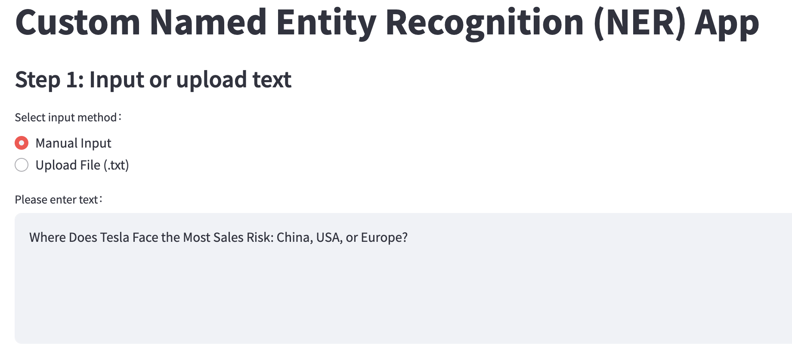
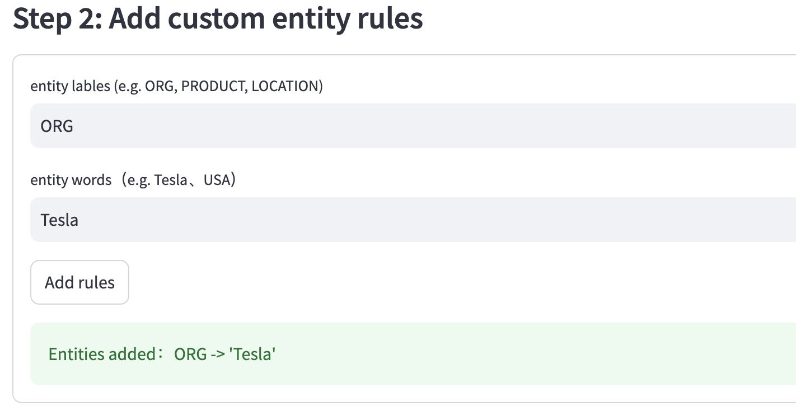

# 🧠 Custom Named Entity Recognition (NER) App

A simple and interactive Streamlit web application for customizing and visualizing named entity recognition using [spaCy](https://spacy.io/).

## 🚀 Project Overview

This application demonstrates how to perform Named Entity Recognition (NER) with [spaCy](https://spacy.io/)'s NLP pipeline and customize it using the `EntityRuler`. It allows users to:
- Input or upload their own text
- Define and add custom entity patterns (e.g., company names, places)
- Visualize recognized entities with color highlighting
- Explore results in a clear, interactive format

This tool is ideal for learning NER, testing custom rules, or exploring text data in a user-friendly interface.

## 📦 Installation & Setup

### 🔧 Requirements

Make sure you have Python 3.7+ installed. Required Python libraries:

- `streamlit`
- `spacy`

### 📥 Install dependencies

```bash
pip install streamlit spacy
python -m spacy download en_core_web_sm

▶️ Run the app locally
bash
streamlit run main.py

🌐 Deployed Version
- [View Live App](http://localhost:8501/)


✨ App Features
1. Input Text
Users can either:

Manually enter text into a text area
Upload a .txt file for analysis

2. Add Custom Entity Rules
Users can define new entities using label (e.g., ORG, PRODUCT) and pattern (e.g., "Tesla", "San Francisco") via a form. These rules are added with spaCy’s EntityRuler.

Example:
Label: ORG
Pattern: Tesla

3. View NER Results
All detected entities are highlighted with colors using spaCy’s built-in visualizer displacy.

A list of recognized entities is also displayed below the text.

📚 References & Resources
spaCy Documentation
spaCy EntityRuler Guide
Streamlit Documentation


🖼️ Visual Examples
1. 

2. 

3.
