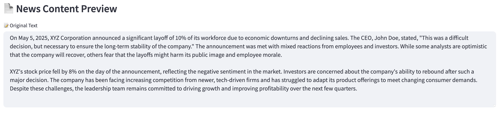
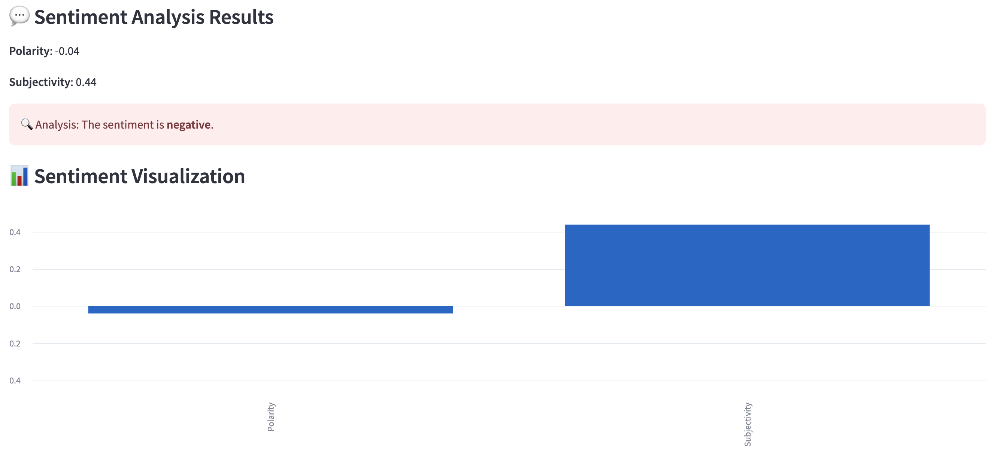
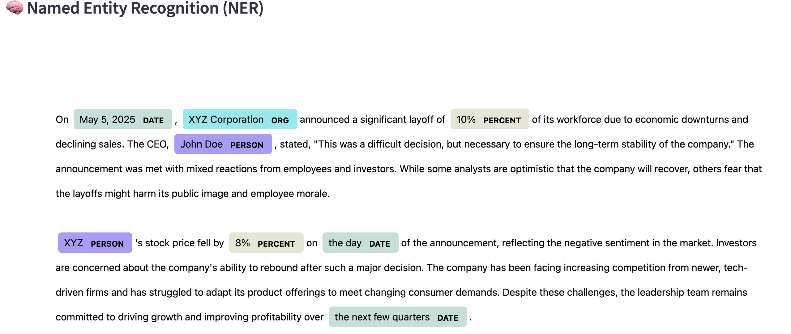

## 📉 Company Crisis News Sentiment Analyzer  
This is a simple and clean Streamlit web app designed to analyze the sentiment of news related to company crises. The app uses TextBlob for sentiment analysis and spaCy for Named Entity Recognition (NER), providing intuitive visualizations for both.

### 🧠 Background  
My academic background is in organizational crisis management. In this field, understanding how the public reacts to corporate crises is crucial. Natural Language Processing (NLP), especially sentiment analysis, plays a key role in tracking public opinion in news media. I developed this app to provide an accessible interface for analyzing the sentiment of crisis-related news. The integrated NER visualization further helps to clearly identify key entities in the news, aiding interpretation and analysis.

### 🔍 Features  
#### Text Input: 
Directly type or paste news content into the text area to analyze it immediately.

#### Text File Upload: 
Upload .txt files containing news articles or reports.

#### Sentiment Analysis:

Calculates polarity (positive–negative) and subjectivity (objective–subjective).

Displays interpretation of the sentiment result (positive / negative / neutral).

#### Named Entity Recognition (NER): 
Highlight organizations, people, dates, and other named entities using spaCy.

#### Visualization:

Bar chart of polarity and subjectivity scores.

Inline rendering of Named Entity Recognition results.

## 📸 Screenshots

### 📰 News Content Preview

### 📊 Sentiment Analysis

### 🧠 Named Entity Recognition

📁 File Structure 

📦 StreamlitAppFinal  
 ┣ 📄 main.py  
 ┣ 📁 images  
 ┃ ┣ 📄 news_content_preview.png  
 ┃ ┣ 📄 sentiment_analysis.png  
 ┃ ┗ 📄 ner.png  
 ┗ 📄 README.md  

🚀 How to Use
Run the Streamlit app:
streamlit run main.py
Upload a .txt file with news content or Directly type or paste news content into the text area to analyze it immediately

View sentiment analysis results and named entities directly in the browser.

📚 References & Resources  
- [spaCy Documentation](https://spacy.io/usage)  
- [spaCy EntityRuler Guide](https://spacy.io/usage/rule-based-matching#entityruler)  
- [Streamlit Documentation](https://docs.streamlit.io/)
- [TextBlob Documentation](https://textblob.readthedocs.io/en/dev/)