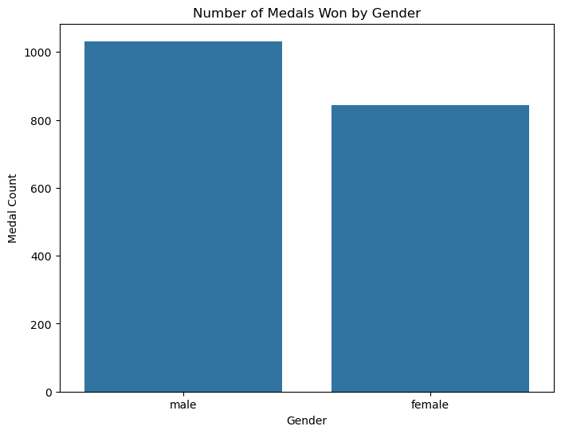
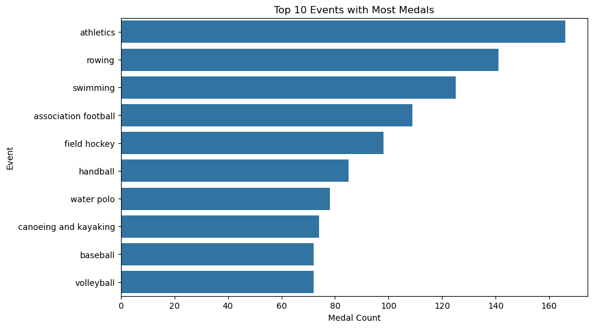

# Tidy Data Project
## Project Overview
The goal of this project is to apply tidy data principles to a 2008 Olympics Medalists dataset. The tidy data principles emphasize organizing the data such that:

Each variable is in its own column.
Each observation forms its own row.
Each type of observational unit forms its own table.
This project demonstrates how to clean, transform, and visualize sports data by applying these principles. The project involves reshaping the data to make it more suitable for analysis and visualization, and creating useful insights from the cleaned data.

## Instructions
1. Install libraries:
pandas
matplotlib
seaborn
2. Run the Jupyter Notebook

## Dataset Description
The dataset used in this project contains information on athletes and the medals they have won in various sports events. It includes columns like athlete names, gender, event names, and the medal types (gold, silver, bronze).

Pre-processing Steps:
Reshaping: The data was reshaped from wide to long format using the melt() function.
Cleaning: The data was cleaned by removing rows with missing values and splitting the sports column into gender and event columns.
Visualization: After cleaning, the data was visualized to explore the number of medals won by each gender and event.

References
- [Pandas Cheat Sheet](https://pandas.pydata.org/Pandas_Cheat_Sheet.pdf)
- [Tidy Data Paper by Hadley Wickham](https://vita.had.co.nz/papers/tidy-data.pdf)

Visual Examples
1. 

2. 

Code Snippet Examples

### Split the 'sports' column into 'gender' and 'event'
tidy_data[["gender", "event"]] = tidy_data["sports"].str.split("_", expand=True)

### Drop the 'sports' column
tidy_data.drop(columns=["sports"], inplace=True)